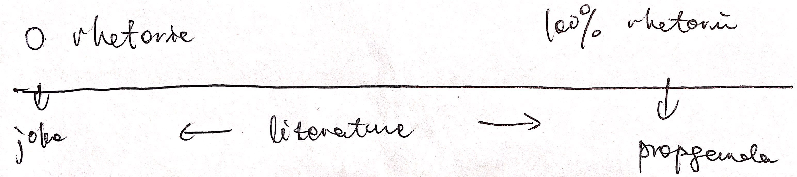

# [Rhetorical Situation](https://owl.purdue.edu/owl/general_writing/academic_writing/rhetorical_situation/index.html)
## What is of _rhetoric_
Rhetoric = any communication used to modify the perspectives of others.  
Aristotle: rhetoric is “an ability, in each particular case, to see the available means of persuasion” (Aristotle Rhetoric I.1.2, Kennedy 37) 

## What is _rhetorical situation_
The circumstances in which you communicate to persuade others.

------
# [Author and Audience](https://owl.purdue.edu/owl/general_writing/academic_writing/rhetorical_situation/author_and_audience.html)
## Author
### Definition:
one who 
- communicates
- create medium to communicate

## Audience
### Definition
one who
- receives communication
- consumes communicative media

## Background of author and audience
- Elements including 
    * age
    * gender
    * geographic location
    * ethnicity
    * cultural experiences
    * religious experiences
    * social standing
    * personal wealth
    * sexuality
    * political beliefs
    * parents
    * peers
    * level of education
    * personal experience  
- Background influences:
    * authors'
        * World view: what is the world
        * assumptions made about her readers: who is her readers?
        * what and how they communicate
    * readers'
        * Understanding of the media

------
# [Tone and Purpose](https://owl.purdue.edu/owl/english_as_a_second_language/esl_students/audience_considerations_for_esl_writers/tone_and_purpose.html)
------
# [Genre and Medium](https://owl.purdue.edu/owl/subject_specific_writing/professional_technical_writing/business_writing_for_administrative_and_clerical_staff/genre_and_medium.html)
------
# [Stance and Language](https://owl.purdue.edu/owl/subject_specific_writing/professional_technical_writing/business_writing_for_administrative_and_clerical_staff/genre_and_medium.html)
------
