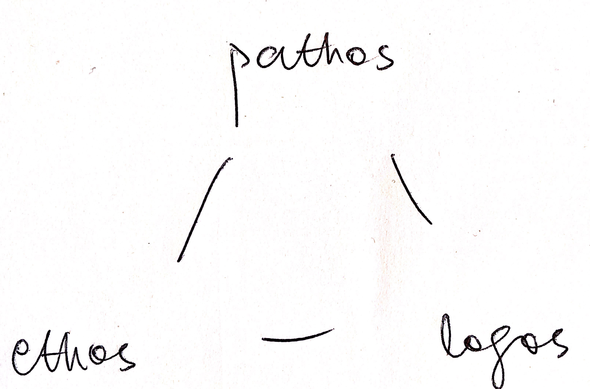

# Rhetorical Analysis

## Rhetorical Triangle

- Ethos: The authority or credibility of the author.
- Pathos: Emotional appeals to the audience.
- Logos: Logic and truth.

## Cliched Way to Do Rhetorical Analysis

- Description: What did it say?
- Analysis: Use the framework you've learned.
- Evaluation: Is it effective? To whom?
